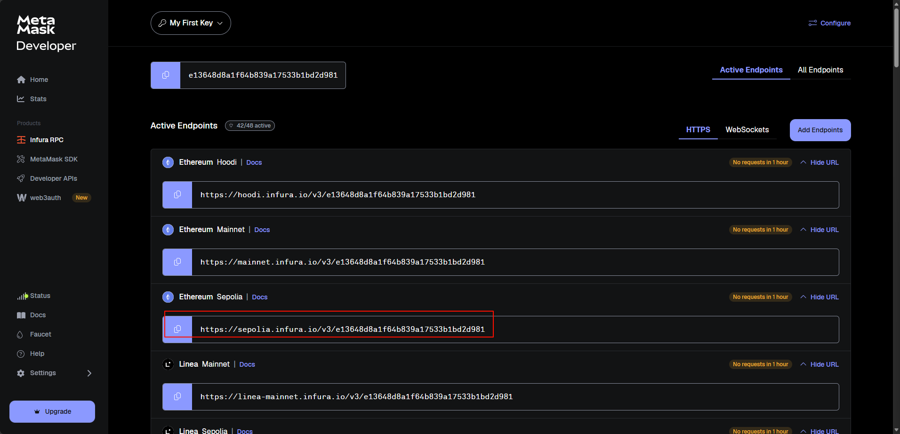
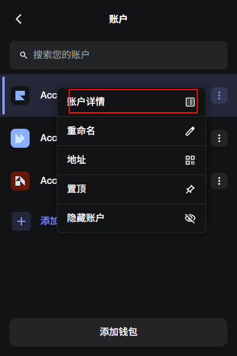
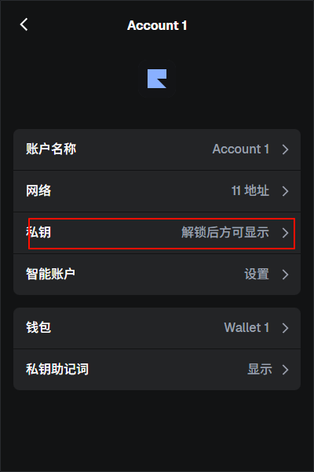
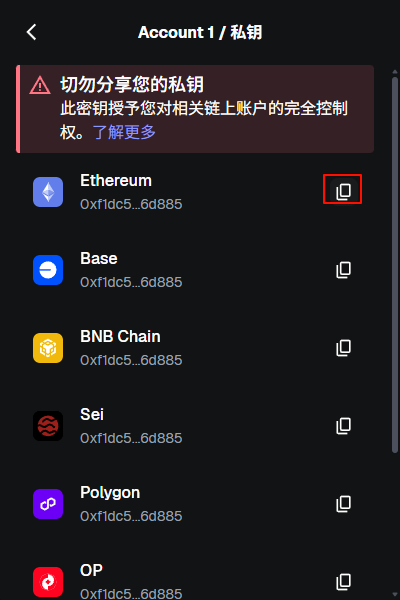

# 合约上链前配置
````shell
npx hardhat keystore set SEPOLIA_RPC_URL
npx hardhat keystore get SEPOLIA_RPC_URL
npx hardhat keystore set SEPOLIA_PRIVATE_KEY # 
npx hardhat keystore get SEPOLIA_PRIVATE_KEY # 当前项目我设置为 二级密码
````
* SEPOLIA_RPC_URL: https://sepolia.infura.io/v3/e13648d8a1f64b839a17533b1bd2d981
* SEPOLIA_PRIVATE_KEY: d83b71706148ba1799ce40eca3ea9d581e848ca87f01a0f46ae6b98df
* 当前项目我设置为 二级密码 (和当前电脑捆绑的)

## 获取 SEPOLIA_RPC_URL
https://developer.metamask.io/key/active-endpoints


## 如何获取 SEPOLIA_PRIVATE_KEY







* 这里复制出来的确实是私钥, 并不是 0xF1DC5Df8114fdd22B43a3925C8A0A768A776D885, 没看到 sepolia 的, 直接复制 Ethereum 的就可以 

# 部署合约示例

## 部署 Counter.sol 到模拟网络
````shell
npx hardhat ignition deploy ./ignition/modules/Counter.ts
````

## 部署 Counter.sol 到 sepolia 测试网络
````shell
npx hardhat ignition deploy ./ignition/modules/Counter.ts --network sepolia
````
> 需要确保正确配置好 sepolia
> ./hardhat.config.ts
````text
networks: {
  hardhatMainnet: {
    type: "edr-simulated",
        chainType: "l1",
  },
  hardhatOp: {
    type: "edr-simulated",
        chainType: "op",
  },
  sepolia: {
    type: "http",
        chainType: "l1",
        url: configVariable("SEPOLIA_RPC_URL"),
        accounts: [configVariable("SEPOLIA_PRIVATE_KEY")],
  },
},
````
部署成功示例
````text
C:\nvm\v22.21.1\npm.cmd run ignition:counter:sepolia
> hardhat ignition deploy ./ignition/modules/Counter.ts --network sepolia

[hardhat-keystore] Enter the password: ************
√ Confirm deploy to network sepolia (11155111)? ... yes
Hardhat Ignition 🚀

Deploying [ CounterModule ]

Batch #1
  Executed CounterModule#Counter

Batch #2
  Executed CounterModule#Counter.incBy

[ CounterModule ] successfully deployed 🚀

Deployed Addresses

CounterModule#Counter - 0xA46018D65E7e26ba3E85f76Ac0DbFaD75e031af7

进程已结束，退出代码为 0
````

# 验证合约示例

## 本地验证
````text
PS D:\Program Files Project\web3\@course\meta-node\solidity\mine\solidity_lesson\my-hardhat3-project> npx hardhat ignition status chain-11155111
Deployment chain-11155111 (chainId: 11155111) was successful

Deployed Addresses

CounterModule#Counter - 0xA46018D65E7e26ba3E85f76Ac0DbFaD75e031af7
````

## 在线验证

可以去 https://sepolia.etherscan.io/address/0xa46018d65e7e26ba3e85f76ac0dbfad75e031af7 验证部署结果

也可以在命令获取部署信息

````text
PS D:\Program Files Project\web3\@course\meta-node\solidity\mine\solidity_lesson\my-hardhat3-project> npx hardhat ignition status chain-11155111
Deployment chain-11155111 (chainId: 11155111) was successful

Deployed Addresses

CounterModule#Counter - 0xA46018D65E7e26ba3E85f76Ac0DbFaD75e031af7
````

etherscan 需要配置 apiKey 才能校验

可以在 https://etherscan.io/apidashboard 中配置 apiKey 用于校验合约状态

````text
PS D:\Program Files Project\web3\@course\meta-node\solidity\mine\solidity_lesson\my-hardhat3-project> npx hardhat ignition verify chain-11155111 --network sepolia       
Verifying contract "contracts/Counter.sol:Counter" for network sepolia...

=== Etherscan ===
[hardhat-keystore] Enter the password: Warning: Detected unsettled top-level await at file:///D:/Program%20Files%20Project/web3/@course/meta-node/solidity/mine/solidity_lesson/my-hardhat3-project/node_modules/hardhat/dist/src/cli.js:21
await main(process.argv.slice(2), { registerTsx: isTsxRequired() });
^


PS D:\Program Files Project\web3\@course\meta-node\solidity\mine\solidity_lesson\my-hardhat3-project> npx hardhat ignition verify chain-11155111 --network sepolia

Verifying contract "contracts/Counter.sol:Counter" for network sepolia...

=== Etherscan ===
[hardhat-keystore] Enter the password: ************

📤 Submitted source code for verification on Etherscan:

  contracts/Counter.sol:Counter
  Address: 0xA46018D65E7e26ba3E85f76Ac0DbFaD75e031af7

⏳ Waiting for verification result...


The initial verification attempt for contracts/Counter.sol:Counter failed using the minimal compiler input.

Trying again with the full solc input used to compile and deploy the contract.
Unrelated contracts may be displayed on Etherscan as a result.


📤 Submitted source code for verification on Etherscan:

  contracts/Counter.sol:Counter
  Address: 0xA46018D65E7e26ba3E85f76Ac0DbFaD75e031af7

⏳ Waiting for verification result...


✅ Contract verified successfully on Etherscan!

  contracts/Counter.sol:Counter
  Explorer: https://sepolia.etherscan.io/address/0xA46018D65E7e26ba3E85f76Ac0DbFaD75e031af7#code

=== Blockscout ===

The contract at 0xA46018D65E7e26ba3E85f76Ac0DbFaD75e031af7 has already been verified on Blockscout.

If you need to verify a partially verified contract, please use the --force flag.

Explorer: https://eth-sepolia.blockscout.com/address/0xA46018D65E7e26ba3E85f76Ac0DbFaD75e031af7#code

=== Sourcify ===

The contract at 0xA46018D65E7e26ba3E85f76Ac0DbFaD75e031af7 has already been verified on Sourcify.

If you need to verify a partially verified contract, please use the --force flag.

Explorer: https://sourcify.dev/server/repo-ui/11155111/0xA46018D65E7e26ba3E85f76Ac0DbFaD75e031af7

````

# 启动本地节点 localhost
````text
> my-hardhat3-project@1.0.0 node
> hardhat node

Started HTTP and WebSocket JSON-RPC server at http://127.0.0.1:8545/

Accounts
========

WARNING: Funds sent on live network to accounts with publicly known private keys WILL BE LOST.

Account #0:  0xf39fd6e51aad88f6f4ce6ab8827279cfffb92266 (10000 ETH)
Private Key: 0xac0974bec39a17e36ba4a6b4d238ff944bacb478cbed5efcae784d7bf4f2ff80

Account #1:  0x70997970c51812dc3a010c7d01b50e0d17dc79c8 (10000 ETH)
Private Key: 0x59c6995e998f97a5a0044966f0945389dc9e86dae88c7a8412f4603b6b78690d

...
````
开启本地的常驻模拟服务, 只要窗口不关闭就一直可以使用服务

可以指定 `--network localhost` 

# 测试
## 本地持久化测试
````shell
npx hardhat node # 开启本地化服务(关闭后就会丢失, 不是临时的)

npx ignition:deploy:vault:localhost # 部署合约到 本地化服务

npx hardhat test ./test/Vault.ts # 单独测试 Vault 合约
````